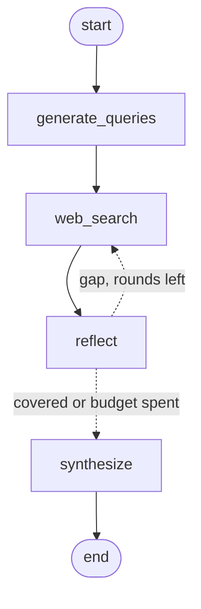

# LLM Research Agent

[](https://github.com/BillVu05/llm-research-agent/actions/workflows/ci.yml)
[](https://www.python.org/)
[](LICENSE)
[](tests/)

**Ask a question in plain English, get a short cited answer as strict JSON.**

A [LangGraph](https://langchain-ai.github.io/langgraph/) `StateGraph` of four nodes.
The interesting part is the **conditional edge**: after searching, the agent judges
whether the documents it found actually cover every fact the question needs. If they
don't, it writes targeted follow-up queries and searches again.

```console
$ research-agent "Who won the 2019 Cricket World Cup final, how was the tie resolved, and where was it played?"
{
  "answer": "England won the 2019 Cricket World Cup final [1][2]. After both the match and the subsequent Super Over ended in ties [2], the tie was resolved using the boundary count-back rule, which England won by scoring 26 boundaries to New Zealand's 17 [4]. The match was played at Lord's in London [1][6].",
  "citations": [
    { "id": 1, "title": "ENG vs NZ Cricket Scorecard, Final at London, July 14, 2019", "url": "https://www.cricinfo.com/..." },
    { "id": 2, "title": "2019 Cricket World Cup", "url": "https://en.wikipedia.org/wiki/2019_Cricket_World_Cup" }
  ],
  "degraded": false
}
```

**Contents** · [How it works](#how-it-works) · [Design decisions](#design-decisions) ·
[Retrieved text is untrusted](#retrieved-text-is-untrusted) ·
[Failure behaviour](#failure-behaviour) · [Quickstart](#quickstart) ·
[Configuration](#configuration) · [Testing](#testing) · [Evaluation](#evaluation) ·
[Layout](#layout)

---

## How it works



| Node | Does |
| --- | --- |
| `generate_queries` | One Gemini call plans both the search queries **and the "slots"** — the specific facts a complete answer must contain for *this* question. |
| `web_search` | Runs the queries concurrently through SerpAPI, keeping snippets and keeping only URLs not already seen. |
| `reflect` | Gemini judges which slots the retrieved documents actually support, and writes a targeted follow-up query for each missing slot. |
| `synthesize` | Writes an ≤80-word answer citing sources by number. |

## Design decisions

- **Slots are derived per question**, not looked up in a table, so coverage checking
  works on any topic at no extra cost — the planning call returns them anyway.
- **Citations are rebuilt from the retrieved documents** using the indices the model
  returns. A cited URL is therefore provably one the agent fetched; an invented
  source is dropped rather than surfaced.
- **Synthesis reads search snippets**, not titles alone, so the answer is grounded in
  retrieved text rather than in the model's own recall.
- **A follow-up round's documents go to the front of the context window.** Only the
  first `MAX_CONTEXT_DOCS` are shown to the model and round one alone returns far
  more than that, so appending them would have buried exactly the evidence the
  reflection loop went back out to fetch. This one was a live bug — see
  [Regressions worth knowing about](#regressions-worth-knowing-about).

## Retrieved text is untrusted

Snippets come off the open web and land in a prompt, so a page that ranks for one of
our queries gets to put words in front of the model. Three cheap defences:

1. every document is fenced in a `<document>` tag,
2. every field is length-capped, so one result cannot crowd out the others,
3. both prompts that embed retrieved text open by saying the fenced content is data
   and never instructions.

That is mitigation, not immunity — treat the answer as attacker-influenceable if the
topic is. Citation rebuilding limits the blast radius: no document can make the agent
cite a URL it never fetched.

## Failure behaviour

The CLI writes **only** JSON to stdout; every diagnostic, `--debug` included, goes to
stderr. `research-agent "..." | jq` is safe even on a failing run.

| Failure | Behaviour |
| --- | --- |
| SerpAPI error, quota, timeout | That query contributes no documents |
| Throttling (429), 5xx, timeout | Retried with exponential backoff |
| Safety block | Not retried — it fails identically every time — and logged distinctly |
| Unparseable model JSON | Falls back to the caller's default |
| No documents at all | `"degraded": true`, exit 1 |

Nothing exits with a traceback. Both APIs have explicit timeouts: SerpAPI's own
default is `60000`, handed to `requests` as **seconds**, which is not a timeout.

## Quickstart

```bash
git clone https://github.com/BillVu05/llm-research-agent.git
cd llm-research-agent
pip install -e .              # or: pip install -r requirements.txt

cp .env.example .env          # then add your keys
research-agent "your question" --debug
```

Installing gives you the `research-agent` command. Without installing, the script
runs directly: `python src/agent/cli.py "your question"`.

Keys come from [SerpAPI](https://serpapi.com/manage-api-key) and
[Google AI Studio](https://aistudio.google.com/app/apikey).

> [!NOTE]
> `load_dotenv()` does not override variables already set in your shell. If a stale
> `GEMINI_API_KEY` is exported in your environment, it wins over `.env`.

### Docker

```bash
docker compose run --rm agent "your question"
```

## Configuration

| Variable | Default | Purpose |
| --- | --- | --- |
| `GEMINI_API_KEY` | — | **required** |
| `SERPAPI_API_KEY` | — | **required** |
| `GEMINI_MODEL` | `models/gemini-flash-latest` | pin a model for reproducible runs |
| `SEARCH_LANG` | `en` | Google `hl`; set it for non-English questions |
| `SEARCH_COUNTRY` | `us` | Google `gl` |

A pinned model name is a time bomb — `gemini-1.5-flash` was retired and every live
run started returning 404. The default is a rolling alias for that reason.

The Gemini free tier is rate limited (as low as 5 requests/minute) and one eval case
costs 3–4 calls, so pace long runs with `--sleep`.

**Exit codes:** `0` a real answer · `1` a fallback answer (`"degraded": true`).

## Testing

```bash
pip install -r requirements-dev.txt
pytest          # 52 tests, no API keys required, < 1s
ruff check .
```

The tests assert **which graph nodes ran**, not only the final output. An earlier
version of this pipeline never executed `reflect` at all and its test suite still
passed green, because nothing checked. That regression now has a named test.

### Regressions worth knowing about

Each of these shipped once and now has a test that fails if it comes back.

| Test | Regression it pins |
| --- | --- |
| `test_round_two_docs_reach_the_model` | Follow-up results were appended past the context window, so the reflection loop spent a search and an LLM call on documents the model never saw |
| `test_cli_stdout_stays_json_when_search_fails` | A SerpAPI error printed to stdout ahead of the JSON, so piping a failing run into any parser crashed |
| `test_generate_retries_a_throttled_call` | A single 429 silently degraded the answer |
| `test_search_timeout_is_actually_set` | SerpAPI's default timeout is 60000 *seconds* |
| `test_abstention_case_fails_on_a_confident_fabrication` | A fabricated answer scored PASS as long as it was well-formed |
| `test_reflect_actually_runs` | `reflect` was unreachable; the graph completed without ever checking coverage |

## Evaluation

Unit tests prove the graph is wired correctly; they say nothing about answer quality.
`eval/` scores the agent against a 25-question golden set across four tiers:

| Tier | n | Measures |
| --- | --- | --- |
| `parametric` | 9 | The model probably knows it already — a floor, not a score |
| `retrieval` | 7 | Needs a search to answer |
| `multi_fact` | 7 | Several facts in one question; exercises the reflect loop |
| `abstention` | 2 | Unanswerable or false-premise: graded on **not** inventing an answer |

```bash
python eval/run_eval.py --limit 6 --sleep 25
python eval/run_eval.py --judge --out eval/baseline.json
```

| Metric | Catches |
| --- | --- |
| `answered_rate` | Runs that degraded to a fallback answer |
| `keyword_recall` | Answers missing the expected facts |
| `abstention_rate` | Confident answers to unanswerable questions |
| `citation_validity_rate` | A cited URL that was never retrieved |
| `slot_fill_rate` | How much planned coverage was achieved |
| `second_round_rate` | How often the reflection loop actually fires |
| `word_budget_rate` | Answers over the length budget |
| `mean_llm_calls` | What a question costs, not just how long it takes |
| `mean` / `p95 latency` | Speed regressions |
| `mean_groundedness` | `--judge` only: claims unsupported by sources |

Two things the golden set is built to stop:

- **Keywords too weak to prove anything.** It used to require `"3"`, `"4"`, `"2"` on a
  scoreline — and `"2"` matches `"2022"` in almost any answer, so the case scored 1.0
  while checking nothing. `must_include` entries are now at least three characters,
  enforced by a test.
- **Confident fabrication.** Abstention cases are pass/fail on `must_not_include`. A
  fluent, well-cited, schema-valid answer to "Who won the 2027 World Cup?" is the
  worst output this agent can produce, so it scores FAIL however good it looks.

> [!IMPORTANT]
> **No baseline is committed right now.** The golden set was rebalanced — six
> parametric questions dropped, two abstention and four harder retrieval cases added
> — so the previously published numbers are not comparable and were removed rather
> than reprinted. Regenerate with the `--out` command above before quoting a figure.

**An honest note on `second_round_rate`:** it was 0 on the old, easier set — and until
recently a second round could not have helped anyway, because its documents were
appended past the context window and never reached the model. That is fixed and
pinned, so this number is worth re-measuring rather than trusting.

## Layout

```
src/agent/cli.py          the whole agent (~390 lines)
tests/                    52 tests, all external calls mocked
eval/golden.jsonl         25-question golden set
eval/run_eval.py          scoring harness
docs/design.md            design document
conftest.py               puts src/ and eval/ on sys.path for the suite
pyproject.toml            package metadata, ruff + pytest config
requirements.txt          runtime deps, used by Docker too
requirements-dev.txt      + pytest and ruff, kept out of the image
Dockerfile                non-root, runtime deps only
docker-compose.yml
```

## License

MIT — see [LICENSE](LICENSE).
