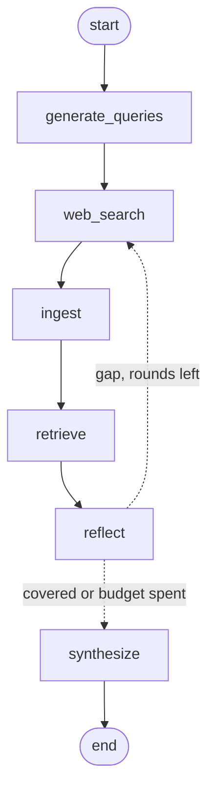

# Design Document: LLM Research Agent

## Overview

A CLI system that answers natural-language research questions by orchestrating a
retrieval-augmented pipeline:

1. **LLM query planning** — search queries *and* the facts the answer must contain
2. **Web search** via SerpAPI
3. **Ingest** — fetch the result pages, extract text, chunk it
4. **Retrieve** — embed and rank the chunks against the question
5. **Self-reflection** on coverage of the required facts
6. **Optional second search pass** if gaps remain
7. **Synthesis** into a concise answer with numbered citations

It outputs a pure JSON object containing the answer and citation list.

---

## System Diagram

The pipeline is a LangGraph `StateGraph`. The edge out of `reflect` is
conditional: a coverage gap routes back to `web_search`, bounded by
`MAX_SEARCH_ROUNDS`.



---

## Module Layout

One concern per module. The agent used to be a single 462-line `cli.py`; the RAG
work (fetching, extraction, chunking, embedding, vector search) had no obvious
home in it and would have pushed it past 900 lines.

| Module | Holds |
| --- | --- |
| `config.py` | Every env var and tunable constant |
| `state.py` | The `ResearchState` TypedDict |
| `llm.py` | `generate`, `embed`, retry policy, `parse_json` |
| `prompts.py` | Every prompt string and the untrusted-text fencing |
| `search.py` | SerpAPI |
| `ingest.py` | Fetch, HTML → text, chunk |
| `retrieval.py` | Lexical prefilter, embed, cosine, MMR, grouping |
| `nodes.py` | The graph nodes |
| `graph.py` | `StateGraph` wiring |
| `cli.py` | argparse and the stdout contract |

**One rule holds the split together:** modules import the *module*, never the
function — `from . import llm` then `llm.generate(...)`, never
`from .llm import generate`. With the latter, a caller binds its own reference
at import time and `monkeypatch.setattr("agent.llm.generate", ...)` silently
does nothing: the tests would pass green while calling the live API.

---

## Component Breakdown

### 1. `generate_queries`

* **Input:** A natural language question.
* **Logic:** One Gemini call plans the whole research step, returning both the
  search queries and the slots — the specific facts a complete answer must
  contain. Deriving slots per question replaced a hardcoded three-topic lookup
  table, and costs no extra call.
* **Output:** `{"queries": [...], "slots": [...], "docs": [], "rounds": 0}`
* **Fallback:** Unparseable output falls back to searching the raw question.

### 2. `web_search`

* **Input:** The current round's queries and the docs gathered so far.
* **Logic:** Runs the queries concurrently through SerpAPI.
* **Deduplication:** Keeps only URLs not already seen, so a second round widens
  the document set rather than replacing it.
* **Ordering:** None. Plain append. Ranking is `retrieve`'s job now — an earlier
  version interleaved a follow-up round's docs into the front half of a fixed
  8-doc window so they would not fall off the end, and that hack is gone.
* **Output:** `{"docs": [{"title", "url", "snippet"}]}`

### 3. `ingest`

* **Input:** The docs, and the set of URLs already ingested.
* **Fetch:** `requests.get` with a real User-Agent, a 10s timeout, and a
  **bounded read** — `MAX_PAGE_BYTES`, because `Content-Length` is a claim, not
  a guarantee, and a 40MB page must not become a 40MB string. Non-HTML content
  types are skipped rather than handed to an HTML parser.
* **Extract:** a stdlib `HTMLParser` subclass drops `<script>`, `<style>`,
  `<nav>`, `<footer>`, `<header>`, `<aside>` and `<form>`, keeps the text, and
  collapses whitespace while preserving paragraph breaks.
* **Chunk:** paragraph-aligned, `CHUNK_SIZE` chars with `CHUNK_OVERLAP` carried
  into the next chunk so a fact that straddles a boundary is not severed and
  retrieved by neither half. A paragraph longer than `CHUNK_SIZE` is cut on
  length, there being no smaller natural boundary.
* **Bounded work:** only `MAX_DOCS_TO_FETCH` new URLs per round, concurrently.
  Fetching is the slow step and the tail of a results page rarely repays it.
* **Fallback:** a page that fails, 403s, paywalls, or yields no text contributes
  **one chunk made from its search snippet**, tagged `source: "snippet"`. This
  is the degradation floor: a run where every fetch fails lands on exactly the
  old snippet-only behaviour rather than on an empty context.
* **Output:** `{"chunks": [{"title", "url", "text", "source"}], "ingested": [...]}`

### 4. `retrieve`

* **Prefilter:** word overlap with the question, down to `MAX_CHUNKS_TO_EMBED`.
  Two real pages is ~140 chunks of which twelve are used, and embedding is
  charged per chunk — embedding all of them buys nothing and walks straight into
  the free tier's 100/minute cap. This is a *cost guard*, not a ranker.
* **Embed:** one batched call for the chunks, one for the question, with
  **different task types** (`retrieval_document` vs `retrieval_query`). They are
  not interchangeable: the model places queries and documents in a comparable
  space precisely because it is told which is which. Using one type for both is
  the classic RAG bug — retrieval still appears to work, just worse.
* **Rank:** cosine similarity, as a single normalized matmul.
* **Diversify:** MMR at `MMR_LAMBDA` down to `TOP_K_CHUNKS`. Plain top-k on a
  news question returns five paragraphs from five outlets reporting the same
  sentence, spending the window the *other* required facts needed.
* **Group:** survivors are merged into one context doc per source URL, so twelve
  chunks off one Wikipedia page stay one citation and the citation-index
  contract is unchanged.
* **Fallback:** no chunks, or an embedding failure, returns search-rank order
  over snippets. The pipeline never hardens a dependency on the embedding API.
* **Output:** `{"context": [{"title", "url", "text"}]}` — deliberately the same
  three-key shape `docs` had, so prompt formatting and citation rebuilding did
  not have to change.

### 5. `reflect`

* **Input:** The retrieved context and the planned slots.
* **Logic:** Gemini judges which slots are explicitly supported. Only slots that
  were actually planned are counted, so the model cannot invent a filled slot,
  and a non-list `filled` reply fills nothing (a bare string would turn `in`
  into a substring test).
* **If missing:** Emits one targeted follow-up query per missing slot,
  preferring the model's own phrasing over the fallback, which glues the whole
  question onto a slot name.
* **Short-circuit:** With no context or no slots it skips the LLM call entirely.
* **Output:** `{"filled": [...], "need_more": bool, "rounds": n, "queries": [...]}`

### 6. `route_after_reflect` (conditional edge)

* Returns `web_search` when `need_more` and `rounds < MAX_SEARCH_ROUNDS`,
  otherwise `synthesize`. This is what bounds the loop.

### 7. `synthesize`

* **Input:** The topic and the retrieved context.
* **Logic:** Gemini writes an ≤80-word answer citing sources by number.
  Citations are then **rebuilt from the retrieved context** using those numbers,
  so a cited URL can never be one the model invented. The index space is capped
  at what `format_docs` actually showed.
* **Output:** `{"answer": "...", "citations": [{"id", "title", "url"}], "degraded": bool}`

---

## Error Handling

| Stage | Strategy |
| --- | --- |
| LLM call failure | `generate` catches, logs to stderr, returns `""`; callers use their default |
| LLM JSON parsing | `parse_json` strips code fences and falls back to a supplied default |
| SerpAPI failures | `try/except` per query; a failed query contributes no documents |
| Page fetch failure | Falls back to that document's search snippet |
| Oversized page | Read truncated at `MAX_PAGE_BYTES` |
| Non-HTML content | Skipped before parsing |
| Malformed HTML | Parse error costs one page, not the run |
| Embedding failure | Retrieval falls back to search-rank order over snippets |
| Invented sources | Citations rebuilt from retrieved context; unknown indices dropped |
| Degraded output | `degraded: true` marks a fallback answer, so callers need not string-match |
| Runaway loop | `MAX_SEARCH_ROUNDS` caps the reflect → web_search cycle |
| Throttling / 5xx | `generate` and `embed` retry with exponential backoff |
| Safety block | Not retried — it is deterministic — and logged distinctly |
| Hung socket | Explicit timeouts on all three APIs; SerpAPI's own default is 60000 *seconds* |

`stdout` carries only the JSON result. Every diagnostic, including `--debug`
output, goes to `stderr`, so piping the result into a parser is safe on a
failing run. There is no path that exits with a traceback. A degraded answer
exits 1.

The theme is that every failure degrades to the *previous* level of capability
rather than to nothing: no page text falls back to the snippet, no embeddings
falls back to search rank, no documents falls back to an explicit refusal.

---

## Security

Retrieved text is attacker-controlled input placed into a prompt: a page that
ranks for one of the agent's queries gets to address the model directly. Now
that whole pages are fetched rather than 400-character snippets, this matters
more, not less.

The mitigations are deliberately cheap:

1. every document is fenced in a `<document>` tag,
2. every field is length-capped — and the bound is **structural**: at most
   `TOP_K_CHUNKS` chunks are ever retrieved, each at most
   `CHUNK_SIZE + CHUNK_OVERLAP` long, so `MAX_CONTEXT_CHARS` is derived from
   those rather than picked arbitrarily,
3. both retrieval-bearing prompts open by stating that the fenced content is
   data and never commands.

This raises the cost of an attack; it does not eliminate it. Citation rebuilding
limits the blast radius: a document cannot make the agent cite a URL it never
fetched.

## Configuration

`.env` variables loaded via `dotenv`:

```env
SERPAPI_API_KEY=your_key_here
GEMINI_API_KEY=your_key_here
```

Retrieval tuning lives in `src/agent/config.py`: `CHUNK_SIZE`, `CHUNK_OVERLAP`,
`TOP_K_CHUNKS`, `MMR_LAMBDA`, `MMR_POOL`, `MAX_DOCS_TO_FETCH`,
`MAX_CHUNKS_TO_EMBED`, `MAX_PAGE_BYTES`, `EMBED_DIMS`.

A pinned model name is a time bomb, and it has now gone off twice in this
project: `gemini-1.5-flash` was retired, and `text-embedding-004` began
returning 404 during the RAG work. `MODEL_NAME` defaults to a rolling alias for
that reason; embeddings have no rolling alias, so `EMBED_MODEL` is pinned to the
current GA model and overridable via `GEMINI_EMBED_MODEL`.

---

## Testing Strategy

`tests/` holds 87 unit tests. Every Gemini, SerpAPI and HTTP call is mocked, so
the suite needs no API key and runs in well under a second.

Embeddings are faked with a bag-of-words hash (`tests/conftest.py`). Unlike
random vectors it has real cosine semantics — chunks sharing words really do
score as similar — so retrieval tests can assert on *ranking*, not just on
plumbing. It uses `crc32` rather than `hash()` because Python salts string
hashing per process, which would make a collision reorder results on some runs
only.

Tests assert on **which nodes ran**, not only on the final output. An earlier
version of this pipeline never executed `reflect` at all and the suite still
passed, because nothing checked.

* `test_happy_path` / `test_reflect_actually_runs` — the full node sequence
* `test_two_round_supplement` — a coverage gap really does route back to search
* `test_loop_is_bounded` — a persistent gap stops at `MAX_SEARCH_ROUNDS`
* `test_page_text_beats_the_snippet` — the model answers from the fetched page
* `test_one_source_yields_one_citation` — many chunks, one page, one citation
* `test_round_two_evidence_is_retrieved_over_round_one_noise` — a follow-up
  round's evidence reaches the model *via relevance*, not via window surgery
* `test_no_results`, `test_search_error_degrades`, `test_timeout_degrades`
* `test_malformed_llm_json_does_not_crash`, `test_fenced_json_is_parsed`
* `test_invented_citations_are_dropped` — a hallucinated source never surfaces
* `test_cli_emits_only_json_on_stdout` and friends — the stdout contract
* retry policy: `test_generate_retries_a_throttled_call`,
  `..._gives_up_after_the_attempt_budget`, `..._does_not_retry_a_safety_block`
* `test_injection_notice_precedes_retrieved_text_in_every_prompt`,
  `test_long_page_text_is_clipped` — untrusted document handling
* `test_reflect_ignores_a_non_list_filled_field` — a string reply must not
  become a substring match over slot names

`tests/test_ingest.py` — extraction drops chrome and decodes entities, chunks
really overlap, an oversized paragraph still splits, non-HTML is skipped, the
read is bounded, a failed fetch falls back to the snippet, round two does not
refetch round one, and fetching is capped.

`tests/test_retrieval.py` — the relevant chunk outranks the irrelevant one, MMR
drops a near-duplicate that plain top-k keeps, a zero vector does not produce
NaN, chunks from one page become one source, embedding failure falls back to
search rank, a short vector list falls back rather than silently misaligning
chunks with vectors, the prefilter keeps the chunk that matches, and the embed
budget is never exceeded.

```bash
pytest
```

---

## Evaluation

Unit tests prove the pipeline is wired correctly. They say nothing about answer
quality, so `eval/` scores the agent against a 25-question golden set
(`eval/golden.jsonl`), tiered into `parametric` (9), `retrieval` (7),
`multi_fact` (7) and `abstention` (2, graded on declining to answer).

```bash
python eval/run_eval.py --limit 6 --sleep 45          # deterministic metrics
python eval/run_eval.py --judge --out eval-rag.json   # + groundedness
```

Metrics are deterministic unless `--judge` is passed:

| Metric | What it catches |
| --- | --- |
| `answered_rate` | Runs that degraded to a fallback answer |
| `keyword_recall` | Answers that miss the expected facts |
| `context_recall` | **Whether retrieval found the fact at all** |
| `chunk_utilization` | Sources placed in the window and never cited |
| `page_chunk_rate` | Real page text vs snippet fallback |
| `citation_validity_rate` | A cited URL that was never retrieved |
| `slot_fill_rate` | How much of the planned coverage was achieved |
| `second_round_rate` | How often the reflection loop actually fires |
| `has_citations_rate` | Uncited answers |
| `word_budget_rate` | Answers over the length budget |
| `mean/p95 latency` | Regressions in speed |
| `mean_llm_calls` | What a question costs, not just how long it takes |
| `mean_groundedness` | (`--judge`) claims unsupported by the sources |

**`context_recall` is the metric this pipeline was missing.** Read alongside
`keyword_recall` it splits a failure in two: a fact absent from the context is a
*retrieval* problem, and a fact present in the context but absent from the
answer is a *generation* problem. They have completely different fixes, and
before this the two were indistinguishable. `dropped_by_generation` names the
specific keywords in the second case.

Note: the Gemini free tier is rate limited — 5 generate requests/minute, 100
embed requests/minute — and a case costs 3–4 generate calls plus up to
`MAX_CHUNKS_TO_EMBED` embeds, so pace long runs with `--sleep`.

---

## Deployment

### Dockerized Build

The build context is the repo root, so the image installs from the single
`requirements.txt`. Test tooling lives in `requirements-dev.txt` and is not
copied in, and the container runs as a non-root user. The entrypoint is
`python -m agent.cli` with `PYTHONPATH=/app/src`: a module inside a package
cannot be run by path without breaking its relative imports.

```bash
docker compose run --rm agent "<your question>"
```

Or without Compose:

```bash
docker build -t llm-research-agent .
docker run --rm --env-file .env llm-research-agent "<your question>"
```

### Local Usage

```bash
pip install -e .
research-agent --topic "<your question>"
```

---

## Extensibility

Ordered by what the eval would have to show before it is worth building.

| Area | Idea | Add when |
| --- | --- | --- |
| Hybrid retrieval | BM25 fused with vector scores (RRF) | `context_recall` misses keyword-exact facts: scores, dates, proper nouns |
| Reranking | LLM cross-encoder over the MMR survivors | `chunk_utilization` stays low — the right chunks are retrieved but badly ordered |
| Vector store | Chroma or FAISS behind `retrieve()` | The corpus reaches ~100k chunks. At a few hundred, a matmul wins |
| Extraction | `trafilatura` instead of stdlib `HTMLParser` | Boilerplate noise shows up in the retrieved context |
| Caching | Persist fetched pages across eval runs | Repeated eval runs get slow enough to be annoying |
| Tooling | PDF parsing, code search, WolframAlpha | A tier of questions the current tools cannot reach |
| UI | Web or desktop front-end | — |

---

## Conclusion

This project demonstrates a full retrieval-augmented generation pipeline —
document loading, chunking, embedding, vector retrieval, reranking for
diversity, and grounded generation with verifiable citations — wired into a
bounded agent loop that checks its own coverage. Its more useful property is
that every stage has a defined failure mode that degrades to the previous level
of capability rather than to nothing, and an evaluation harness that can tell
which stage is at fault.
