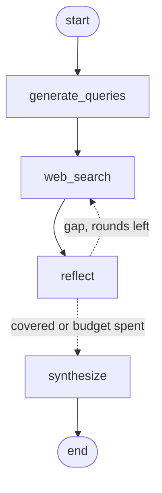

# Design Document: LLM Research Agent

## Overview

The LLM Research Agent is a CLI-based system that answers natural-language research questions by orchestrating a sequence of tools:

1. **LLM query generation**
2. **Web search via SerpAPI**
3. **Self-reflection on coverage of required facts**
4. **Optional second search pass if gaps exist**
5. **Final synthesis into a concise answer with markdown-style citations**

It outputs a pure JSON object containing the answer and citation list.

---

## System Diagram

The pipeline is a LangGraph `StateGraph`. The edge out of `reflect` is
conditional: a coverage gap routes back to `web_search`, bounded by
`MAX_SEARCH_ROUNDS`.



---

## Component Breakdown

### 1. `generate_queries`

* **Input:** A natural language question (e.g. "Who won the 2022 FIFA World Cup?")
* **Logic:** One Gemini call plans the whole research step, returning both the
  search queries and the slots — the specific facts a complete answer must
  contain. Deriving slots per question replaced a hardcoded three-topic lookup
  table, and costs no extra call.
* **Output:** `{"queries": [...], "slots": [...], "docs": [], "rounds": 0}`
* **Fallback:** Unparseable output falls back to searching the raw question.

### 2. `web_search`

* **Input:** The current round's queries and the docs gathered so far.
* **Logic:** Runs the queries concurrently through SerpAPI.
* **Deduplication:** Appends only URLs not already seen, so a second round
  widens the document set rather than replacing it.
* **Output:** `{"docs": [{"title", "url", "snippet"}]}` — the snippet is what
  grounds synthesis in retrieved text rather than in the model's own recall.

### 3. `reflect`

* **Input:** Retrieved docs and the planned slots.
* **Logic:** Gemini judges which slots are explicitly supported by the docs.
  Only slots that were actually planned are counted, so the model cannot
  invent a filled slot.
* **If missing:** Emits one targeted follow-up query per missing slot.
* **Short-circuit:** With no docs or no slots it skips the LLM call entirely —
  re-running identical queries cannot help.
* **Output:** `{"filled": [...], "need_more": bool, "rounds": n, "queries": [...]}`

### 4. `route_after_reflect` (conditional edge)

* Returns `web_search` when `need_more` and `rounds < MAX_SEARCH_ROUNDS`,
  otherwise `synthesize`. This is what bounds the loop.

### 5. `synthesize`

* **Input:** The topic and the accumulated document set.
* **Logic:** Gemini writes an ≤80-word answer citing sources by number.
  Citations are then **rebuilt from the retrieved documents** using those
  numbers, so a cited URL can never be one the model invented.
* **Output:** `{"answer": "...", "citations": [{"id", "title", "url"}], "degraded": bool}`

---

## Error Handling

| Stage            | Strategy                                                                    |
| ---------------- | --------------------------------------------------------------------------- |
| LLM call failure | `_generate` catches, logs to stderr, returns `""`; callers use their default |
| LLM JSON parsing | `_parse_json` strips code fences and falls back to a supplied default        |
| SerpAPI failures | `try/except` per query; a failed query contributes no documents              |
| Invented sources | Citations are rebuilt from retrieved docs, so unknown indices are dropped    |
| Degraded output  | `degraded: true` marks a fallback answer, so callers need not string-match   |
| Runaway loop     | `MAX_SEARCH_ROUNDS` caps the reflect -> web_search cycle                     |

The CLI always emits valid JSON. There is no path that exits with a traceback.

---

## Configuration

The agent uses `.env` variables loaded via `dotenv`:

```env
SERPAPI_API_KEY=your_key_here
GEMINI_API_KEY=your_key_here
```

These are injected in the main file and used by both LLM and web search services.

---

## Testing Strategy

`test/` holds 24 unit tests. Every Gemini and SerpAPI call is mocked, so the
suite needs no API key and runs in well under a second.

Tests assert on **which nodes ran**, not only on the final output. An earlier
version of this pipeline never executed `reflect` at all and the suite still
passed, because nothing checked.

* `test_happy_path` / `test_reflect_actually_runs` — the full node sequence
* `test_two_round_supplement` — a coverage gap really does route back to search
* `test_loop_is_bounded` — a persistent gap stops at `MAX_SEARCH_ROUNDS`
* `test_no_results`, `test_search_error_degrades`, `test_timeout_degrades`
* `test_malformed_llm_json_does_not_crash`, `test_fenced_json_is_parsed`
* `test_invented_citations_are_dropped` — a hallucinated source never surfaces
* `test_snippets_reach_the_model` — retrieved text is actually in the prompt
* `test_urls_are_deduplicated`
* `test_eval.py` — scoring logic for the evaluation harness

```bash
pytest llm-research-agent/test -q
```

---

## Evaluation

Unit tests prove the pipeline is wired correctly. They say nothing about
answer quality, so `eval/` scores the agent against a 20-question golden set
(`eval/golden.jsonl`), tiered into `parametric` (the model likely knows it) and
`retrieval` (it must search).

```bash
python eval/run_eval.py --limit 6 --sleep 25          # deterministic metrics
python eval/run_eval.py --judge --out results.json    # adds LLM groundedness
```

Metrics are deterministic unless `--judge` is passed:

| Metric                   | What it catches                                     |
| ------------------------ | --------------------------------------------------- |
| `answered_rate`          | Runs that degraded to a fallback answer              |
| `keyword_recall`         | Answers that miss the expected facts                 |
| `citation_validity_rate` | A cited URL that was never retrieved                 |
| `slot_fill_rate`         | How much of the planned coverage was achieved        |
| `second_round_rate`      | How often the reflection loop actually fires         |
| `has_citations_rate`     | Uncited answers                                      |
| `word_budget_rate`       | Answers over the length budget                       |
| `mean/p95 latency`       | Regressions in speed                                 |
| `mean_groundedness`      | (`--judge`) claims unsupported by the sources        |

Baseline on the first 6 cases, `models/gemini-2.5-flash`:

```
cases 6 | answered 1.0 | keyword_recall 1.0 | citation_validity 1.0
slot_fill 1.0 | citations/answer 5.2 | docs/question 15.8 | p95 24.9s
```

Note: the Gemini free tier is rate limited (as low as 5 requests/minute) and a
case costs 3-4 calls, so pace long runs with `--sleep`.

---

## Deployment

### Dockerized Build:

The build context is the repo root, so the image can install from the single
top-level `requirements.txt`.

```bash
cd llm-research-agent
docker compose run --rm agent "<your question>"
```

Or without Compose, from the repo root:

```bash
docker build -f llm-research-agent/Dockerfile -t llm-research-agent .
docker run --rm --env-file .env llm-research-agent "<your question>"
```

### Local Usage:

```bash
pip install -r requirements.txt
python llm-research-agent/src/agent/cli.py --topic "<your question>"
```

---

## Extensibility

| Area           | Idea                                                   |
| -------------- | ------------------------------------------------------ |
| Tooling        | Add PDF parsers, code search, WolframAlpha             |
| UI             | Build a web or desktop front-end                       |
| Output Format  | Support HTML/YAML export                               |
| Answer Control | User-defined constraints: tone, length, citation count |
| Slot-Based QA  | Dynamic slot detection based on topic                  |

---

## Conclusion

This project demonstrates structured LLM tool orchestration for research tasks. It maintains robustness across edge cases, supports testing and Docker deployment, and can serve as a base for more advanced autonomous agents.
